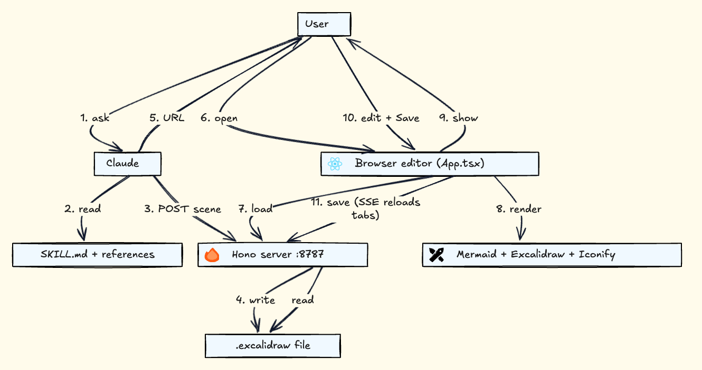

# drawloop-skill

> A Claude Code skill for bidirectional Excalidraw diagram editing — Claude generates, you refine in the browser, both share the same file.

[](https://github.com/sashiksu/drawloop-skill/actions/workflows/ci.yml)
[](LICENSE)

**Demo:** https://sashiksu.github.io/drawloop-skill/

## Why drawloop-skill

Most AI diagram tools generate once and forget. You prompt, you get a diagram, and the moment you nudge a node or recolor a layer, the AI is no longer in the loop — your edits and its understanding diverge. The next prompt regenerates from scratch, and your refinements become disposable.

drawloop-skill takes the opposite stance: **the diagram is a conversation, the file is the conversation state, and Claude reads what you changed before drawing anything new.**

A few specific consequences:

- **Diagrams compound across turns.** Drag a node, swap a palette, save. Ask Claude to "make the cache layer warm-coloured" — it reads the current scene through a token-efficient structured summary (`/api/describe`) and edits *your* layout, not its last guess. Refinements don't reset; they accumulate.

- **It ships as a Claude Code skill, not an MCP server.** Drop the repo into `~/.claude/skills/`, restart Claude Code, and you're done. No `.mcp.json` to author, no separate daemon to manage, no Docker image. The official [`anthropics/skills`](https://github.com/anthropics/skills) repo ships skills for `pdf`, `docx`, `xlsx`, `pptx`, `canvas-design`, and `frontend-design` — but not diagrams. drawloop-skill fills that gap with the same distribution model.

- **Local-first, file-first.** The `.excalidraw` file lives inside your repo, gets versioned by git, and opens directly at [excalidraw.com](https://excalidraw.com) without an export/import dance. No cloud workspace. No second account. No third-party API key beyond the Claude Code session you already have.

- **One job, done well.** drawloop-skill draws diagrams. It doesn't also try to be a Markdown editor, a database client, a PDF viewer, or a tldraw clone. The codebase is small, the surface is narrow, the behaviour is predictable. When you outgrow it, the file is portable to any other Excalidraw tool — there's no lock-in to escape from.

If your current AI diagram workflow involves regenerating from scratch every time you want to tweak a label — this skill is for you.

## Architecture



The diagram above was generated *by drawloop-skill itself*. Claude wrote the Mermaid, the skill resolved it through ELK and Excalidraw, and the PNG was exported with the in-browser button — no other tool involved. Six layers in the picture: skill instructions (markdown read by Claude), CLI scripts, local Hono server, browser-embedded React + Excalidraw UI, on-disk assets, and the external icon catalogs (Iconify + Simple Icons).

## What it does

drawloop-skill opens a local browser-embedded Excalidraw editor. Claude can:

- Generate the initial scene from a prompt (via Mermaid)
- Tag elements with semantic roles (`start`, `service`, `data`, …)
- Embed brand icons (Spring, Postgres, AWS, …) as image elements
- Make follow-up edits via a token-cheap structured scene summary

You can:

- Drag, recolor, delete elements interactively
- Switch palettes from a dropdown (default / warm / cool / mono / aws / azure / gcp / k8s)
- Save → file syncs to disk; Claude reads it on the next turn
- Export to PNG with one click

The `.excalidraw` file is the single source of truth — version-controllable.

## Install

Requires Node ≥20, npm, and Claude Code.

Clone the repo anywhere — `~/drawloop-skill`, `~/code/drawloop-skill`, whatever fits your layout. Only the symlink target (`~/.claude/skills/drawloop-skill`) is fixed.

```bash
# 1. Clone
git clone https://github.com/sashiksu/drawloop-skill.git ~/drawloop-skill
cd ~/drawloop-skill

# 2. Install dependencies (root install hoists into ui/ too)
npm install

# 3. Build the UI bundle (the server serves ui/dist; without this step the
#    browser tab loads but stays blank)
npm run build:ui

# 4. Expose drawloop-skill as a Claude Code skill
mkdir -p ~/.claude/skills
ln -s "$(pwd)" ~/.claude/skills/drawloop-skill
```

Verify the skill is wired up — open Claude Code and ask:

> "Draw a JWT auth diagram in `./diagrams/`."

Claude generates `./diagrams/jwt-auth.excalidraw`, starts a local server on port `8787`, and prints a clickable URL. If you instead get "I don't know how to draw," the symlink isn't being picked up — restart Claude Code or check `ls -l ~/.claude/skills/drawloop-skill`.

### Updating

```bash
cd ~/drawloop-skill
git pull
npm install            # only if dependencies changed
npm run build:ui       # rebuild the UI bundle
```

The skill picks up the new `SKILL.md` automatically; restart any running drawloop-skill server (`pkill -f "tsx server.ts"`) so it serves the freshly built bundle.

## Usage

In Claude Code, ask for any diagram:

> "Draw the OAuth 2.0 authorization code flow."
> "Sketch our microservice topology — frontend, BFF, two backend services, Postgres."
> "Refine the diagram I just edited — make the cache layer warm-coloured."

Claude generates a `.excalidraw` file, opens the browser editor, and lets you iterate. Drag nodes, swap palettes, hit Save, ask for refinements — the file on disk is the single source of truth.

## Develop

```bash
npm run dev          # server with watch (port 8787)
cd ui && npm run dev # UI with Vite HMR (separate port)
npm run check        # biome + tsc + vitest
npm run format       # biome format --write
```

Tests live in `tests/` and run under Node (no browser harness — pure functions are imported from `ui/src/lib/`).

## Contributing

See [`CONTRIBUTING.md`](CONTRIBUTING.md).

## Powered by

drawloop-skill is built on top of excellent open-source projects. Without them, none of this would exist:

| Project | Role in drawloop-skill | License |
|---|---|---|
| [Excalidraw](https://excalidraw.com/) ([source](https://github.com/excalidraw/excalidraw)) | The hand-drawn canvas editor at the heart of the skill — every shape you drag is an Excalidraw element | MIT |
| [Mermaid](https://mermaid.js.org/) | Parses the textual diagram syntax that Claude generates into a node-and-edge graph | MIT |
| [mermaid-to-excalidraw](https://github.com/excalidraw/mermaid-to-excalidraw) | The bridge that converts Mermaid's graph into Excalidraw skeleton elements | MIT |
| [Eclipse Layout Kernel (ELK)](https://www.eclipse.org/elk/) | Alternate layout engine for graphs with heavy cross-subgraph traffic — auto-flipped above 25 nodes | EPL-2.0 |
| [Hono](https://hono.dev/) | Lightweight web framework powering the local Node server (`server.ts`) | MIT |
| [React](https://react.dev/) | UI framework for the browser editor | MIT |
| [Vite](https://vitejs.dev/) | Bundler for the editor UI; produces the static `ui/dist/` served by the server | MIT |
| [Iconify](https://iconify.design/) | Live icon catalog (200,000+ icons across 150+ sets) used by `/api/icon-search` | MIT |
| [Simple Icons](https://simpleicons.org/) | Brand-logo catalog (~3,300 logos) for service iconography (CC0 — no attribution required, but credit given anyway out of respect) | CC0 |

**Tooling:** [TypeScript](https://www.typescriptlang.org/), [Biome](https://biomejs.dev/) (lint + format), [Vitest](https://vitest.dev/) (test runner), [tsx](https://github.com/privatenumber/tsx) (Node TypeScript execution).

The skill itself is glue + opinions — the heavy lifting belongs to the projects above. Please star and support the upstream maintainers if drawloop-skill has been useful to you.

## License

[MIT](LICENSE).
