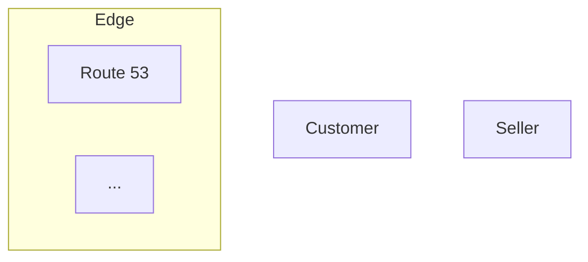

# Pattern library — concept to visual

Each major concept in a multi-concept diagram should use a different visual pattern. Avoid uniform card grids.

## Complexity gate — STOP before drawing

Auto-layout (dagre) breaks down past a threshold. Before writing any Mermaid, count what you're about to declare:

| Signal | Threshold | What to do |
|---|---|---|
| Node count | > 25 | Split into multiple views (see `cloud-presets.md` view-per-concern) |
| Subgraph count | > 5 | Split, OR set `_drawloopSkillPending.layout: "elk"` to switch to ELK renderer |
| Cross-subgraph edges | > 4 spanning 3+ zones | Reorder subgraph declarations so heavy-traffic pairs are adjacent (run `scripts/preview-layout.ts` — it now suggests a reordering) |
| Depth (longest path) | > 8 | Use `LR` (horizontal); `TB` becomes a tall-narrow ribbon |

A diagram that violates two or more of these will render with crossings and long sweeping arrows that need manual cleanup. **The fix is at generation time, not after.** When in doubt, split.

## External actors live OUTSIDE subgraphs

External actors — Customer, Seller, Admin, third-party API, mobile client — represent things that are *not part of the system*. They MUST be declared at the top of the Mermaid before any `subgraph` block:



NOT:

```mermaid
flowchart TB
  subgraph Edge
    Customer["Customer"]   %% wrong: actor stretches the subgraph
    R53["Route 53"]
    ...
  end
```

Subgraphs represent system zones (compute, data, network, observability). Putting actors inside stretches the container to the actor's column and forces zigzag layouts. This is the single most common cause of bad cloud-architecture diagrams.

| Concept type | Pattern | Mermaid hint |
|---|---|---|
| One spawns many (PRD → tasks, root cause → effects) | **Fan-out** — central node with arrows radiating outward | `flowchart LR; A --> B; A --> C; A --> D` |
| Many merge into one (aggregation, funnel) | **Convergence** — multiple inputs arrows merging to single output | `flowchart LR; A --> X; B --> X; C --> X` |
| Sequence of steps (request flow, lifecycle) | **Timeline** — line + dots + labels (use lines, not arrows) | `flowchart TB; S1 --> S2 --> S3` |
| Continuous loop (feedback, iteration) | **Cycle** — arrow returning to start | `flowchart LR; A --> B --> C --> A` |
| Hierarchy (org chart, file tree) | **Tree** — lines + free-floating text (no boxes) | `flowchart TB; root --> a; root --> b; a --> a1; a --> a2` |
| Abstract state (memory, conversation) | **Cloud** — overlapping ellipses | n/a — Excalidraw native ellipses with overlap |
| Transform input → output (pipeline) | **Assembly line** — input shapes → process box → output shapes | `flowchart LR; In --> Process --> Out` |
| Comparison (A vs B, before/after) | **Side-by-side** — parallel structures with visual contrast | n/a — two columns |

## When to use which arrow

- **Solid arrow** (default) — synchronous call, primary flow
- **Dashed arrow** (`strokeStyle: "dashed"`) — async, optional, or annotation
- **Dotted arrow** (`strokeStyle: "dotted"`) — context, observation, "this happens too"
- **Bold arrow** (`strokeWidth: 3`) — hero path, the thing you most want the eye to follow

## Arrow labels

Always label arrows that carry meaning. Unlabeled arrows mean "the relationship is obvious from context" — usually it isn't.

## Sizing

| Tier | Size | Use for |
|---|---|---|
| Hero | 300×150 | The single most important element (one per diagram) |
| Primary | 180×90 | Main concepts |
| Secondary | 120×60 | Supporting concepts |
| Small | 60×40 | Details, satellites |

The most important element has the most empty space around it (200px+).
